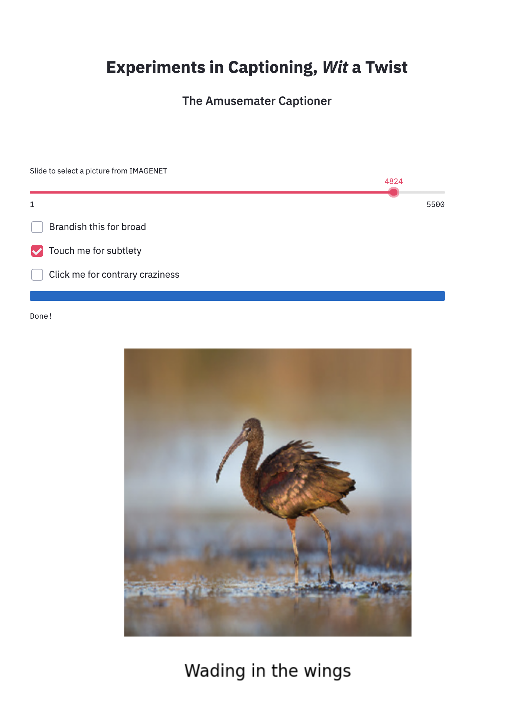
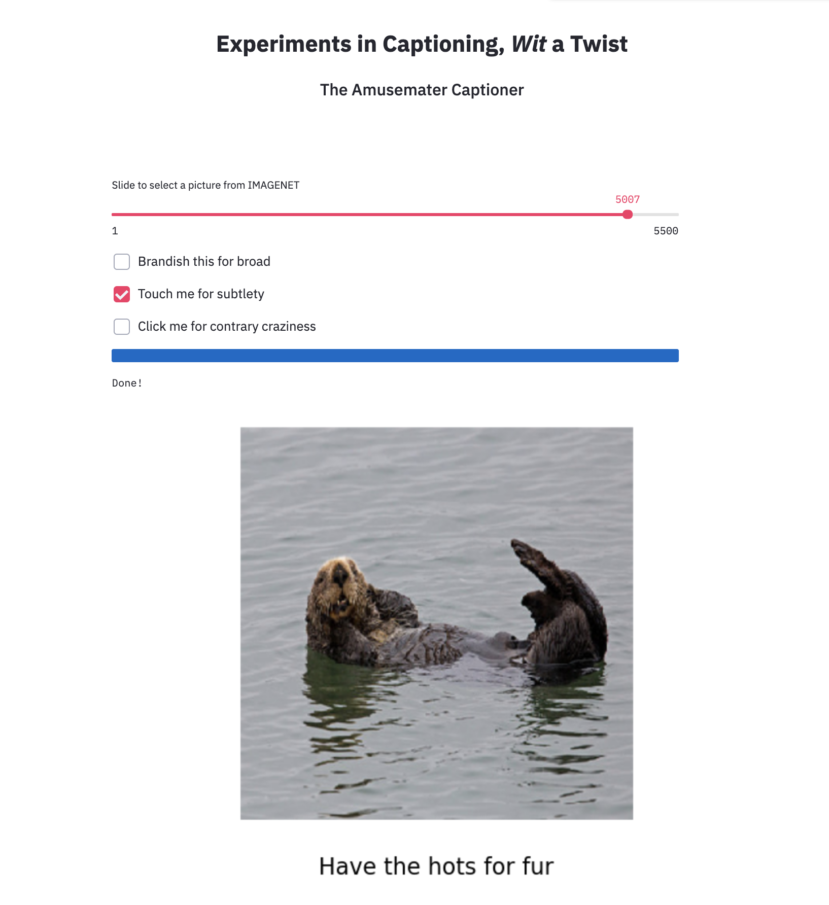
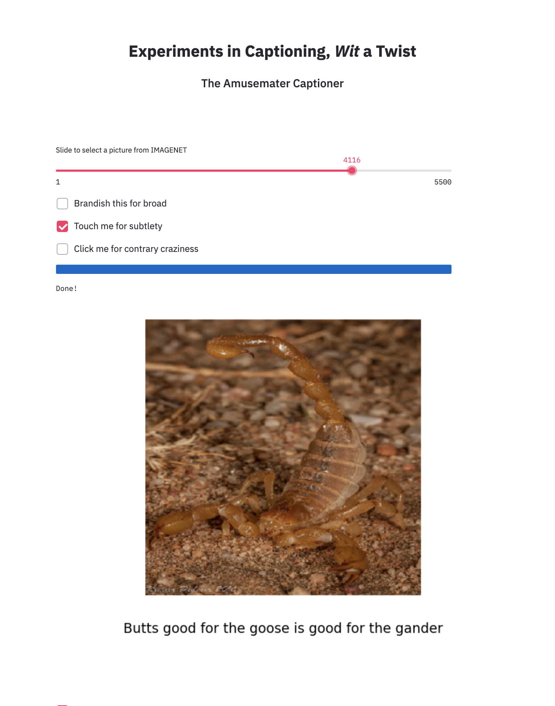
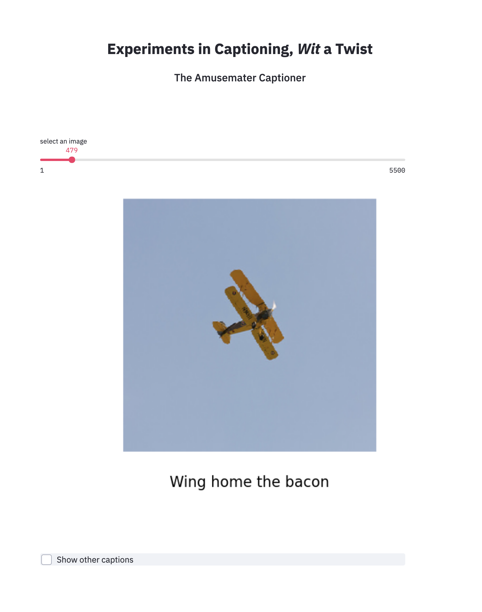
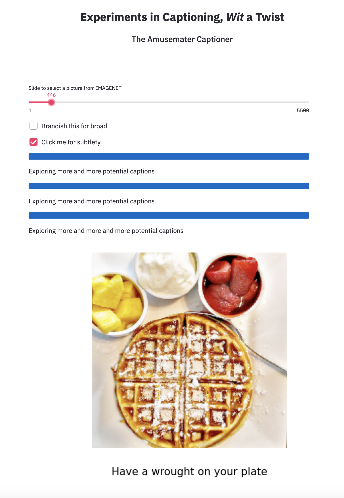
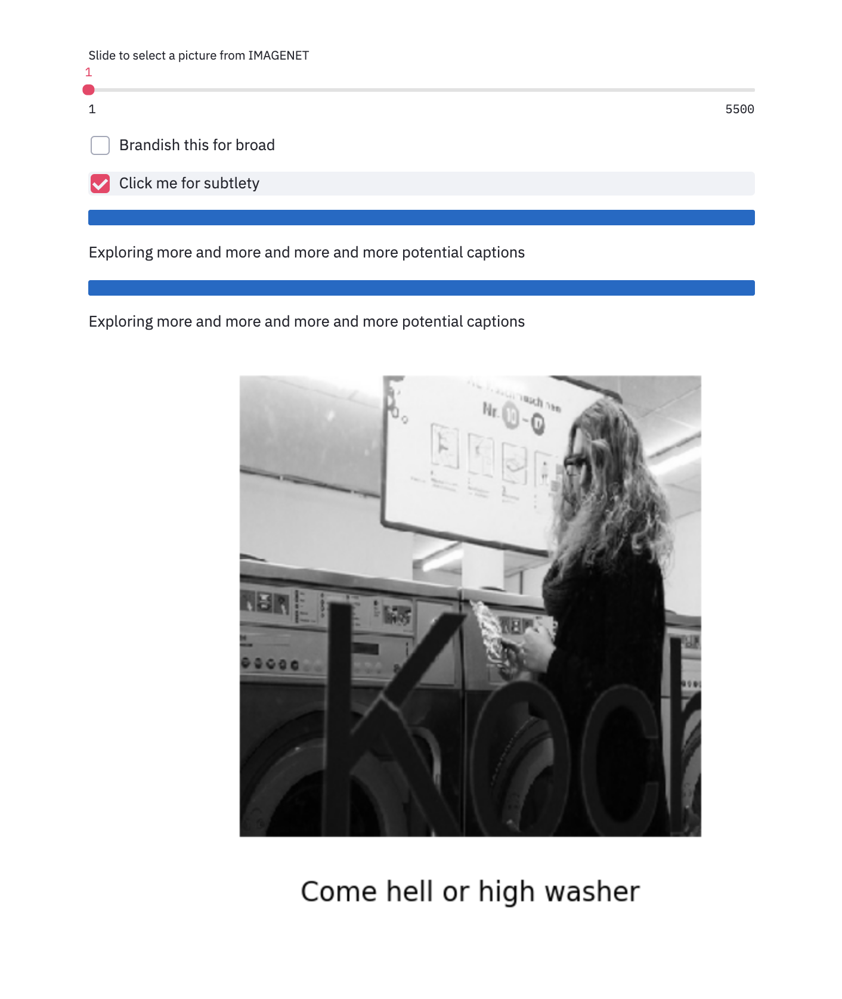
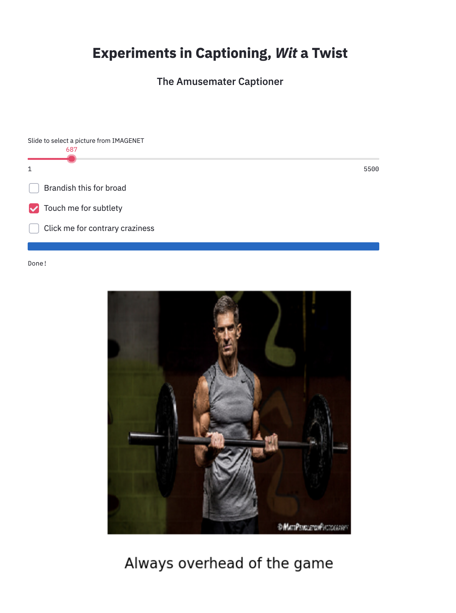
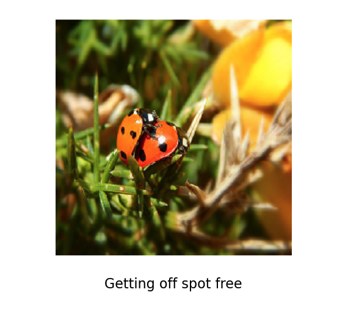
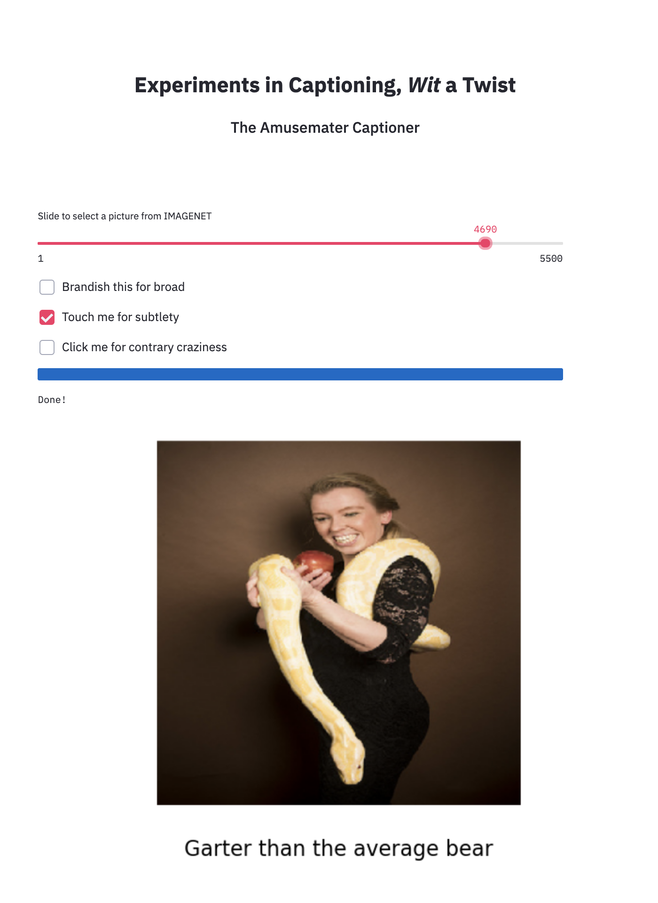
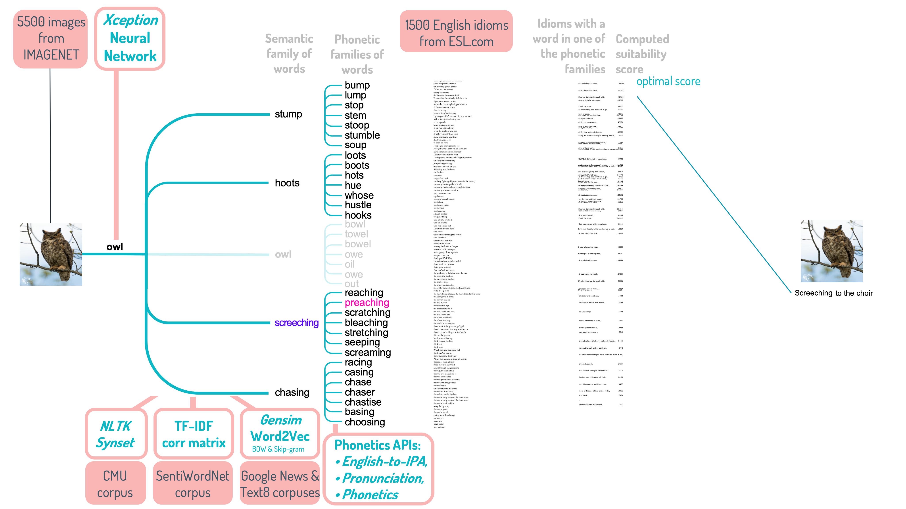

# _Experiments in Captioning, Wit a Twist_
##### Amusemater Captioner

### Description

The _Amusemeter Captioner_ is a stremlit web app that lets machine learning dip its toes into the waters of witty wordplay by inventing image captions that make you smile. To do this, a Neural Network image classifier joins hands with NLP to algorithmically dance right to the verbographic punchline.

####  Data
• 5500 images from IMAGENET, 1500 English idioms from https://7esl.com, and corpuses: 117,000 sentences from the  SentiWordNet corpus, the Gensim Word2Vec Text8, and GoogleNews corpuses, The NLTK Synset corpus of synonyms, the Carnegie Mellon (CMU) corpus of English words, and the International Phonetic Alphabet (IPA)

#### Models and Algorithms
• Pretrained Neural Network (Inception) used for image classification, assigns one of a 1000 possible labels to each image

• Gensim Word2Vec used to identify words related to the image label

• Scikit-learn to make a TF-IDF correlation matrix (over 3 billion datapoints) between SentiWordNet corpus and IMAGENET labels to identify words related to the image label

• NTLK, Levenshstein, and phonetics packages: Pronunciation, Phonetics, and English-to-IPA used to identify similarly sounding words (rhymes, assonances, etsc.)

#### Result:
• A streamlit app that takes any image, classifiies its content, and algorithmically invents a caption that indirectly relates to the image’s content

### Sample output
The app is not yet deployed on the Streamlit site, but here is some sample output:

### The algorithm

